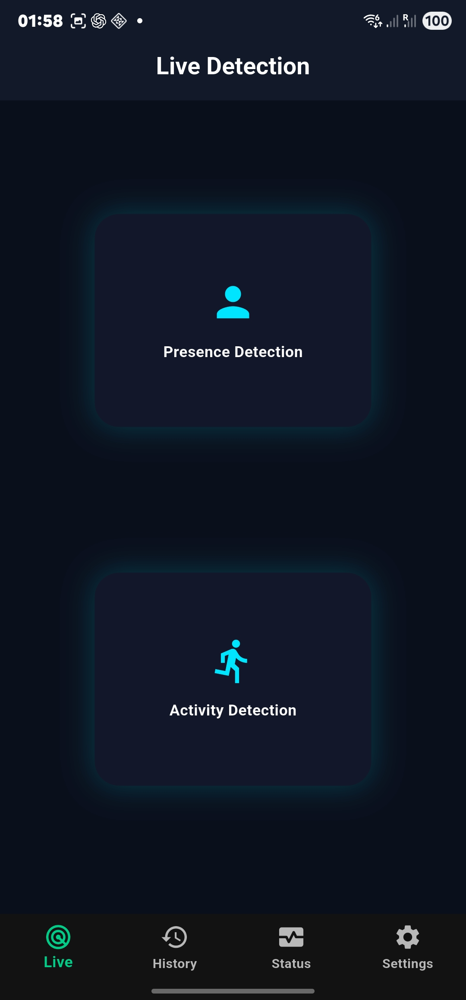
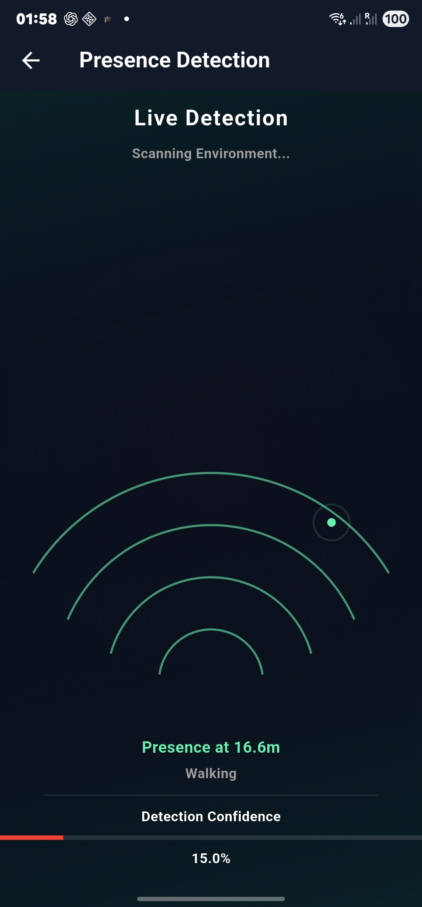
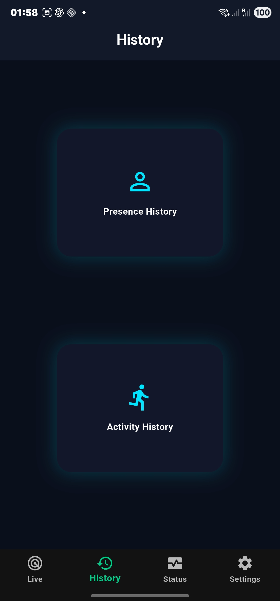

<h1 align="center"> CSI Sense System</h1>

<p align="center">
Human Presence & Activity Detection using Wi-Fi CSI + Mobile Monitoring
</p>

<p align="center">
  
</p>

---

##  Overview

CSI Sense is a **complete end-to-end intelligent monitoring system** that detects human presence and activity using **Wi-Fi signals (CSI)** and visualizes the results in a **real-time mobile application**.

> "From invisible Wi-Fi signals to real-time human insights."

---

##  Preview

<p align="center">
  
  
  
</p>

---

## Features

###  Mobile Application

* Real-time detection interface
* Live monitoring dashboard
* Activity history tracking
* System status visualization
* Settings & configuration

### 📡 Hardware & Detection System

* Wi-Fi CSI-based sensing
* ESP32-based data acquisition
* Spectrogram generation pipeline
* Deep learning-based classification

---

##  System Architecture

```text
WiFi Router → ESP32 (CSI Capture) → Python Pipeline → Spectrograms → ML Model → Mobile App
```

* Wi-Fi signals act as sensing medium
* Human movement alters signal patterns
* Data is processed into spectrograms
* AI model detects presence & activity
* Results are displayed in mobile app

---

##  Core Concept

Human movement affects:

* Signal amplitude
* Signal phase

These changes are converted into **time-frequency spectrograms**:

* X-axis → Time (~400 samples)
* Y-axis → Subcarriers (52)
* Pixel value → Signal strength

---

##  Tech Stack

###  Mobile

* Flutter
* Dart
* Provider (State Management)

###  Backend / Processing

* Python (PyTorch, NumPy)
* Spectrogram Processing Pipeline

###  Hardware

* ESP32-S3 (CSI Receiver)
* Wi-Fi Router (Transmitter)
* Raspberry Pi
* Biquad Antenna

---

##  Project Structure

lib/
├── core/
│   ├── features/
│   │   ├── home/
│   │   ├── history/
│   │   ├── settings/
│   │   └── system_status/
│   ├── services/
│   └── models/
├── widgets/

---

##  Architecture Highlight (Mobile)

The mobile app uses a **modular Detection Controller system**:

* Detection State Manager
* Detection Stream Manager
* Detection History Manager
* Detection Failure Manager

Ensures:

* Real-time updates
* Scalable structure
* Clean separation of logic

---

##  Machine Learning

* Model: EfficientNetV2-S
* Input: CSI Spectrogram Images
* Output:

  * Presence Detection
  * Activity Classification

Metrics:

* Accuracy
* Precision
* Recall
* F1 Score

---

##  Applications

*  Smart Home Monitoring
*  Disaster Rescue (detect trapped people)
*  Security & Surveillance
*  Intelligent Environment Sensing

---

##  System Status

*  Hardware implemented
*  CSI data acquisition working
*  ML model trained
*  Mobile app integrated
*  Real-time optimization ongoing

---

## Flutter Application Developed By

**Surya Pratik**

⭐ Star this repo if you like it!
